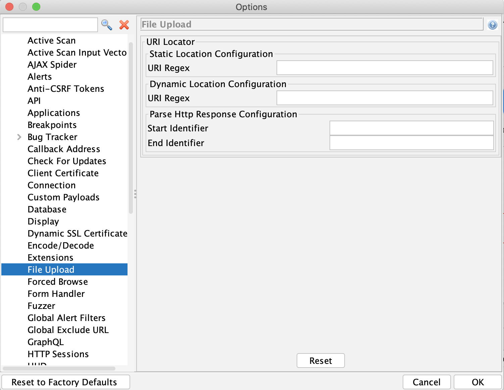

# owasp-zap-fileupload-addon  
   

This project contains the File Upload scan rule which is used to find the vulnerabilities in File Upload functionality.

## Why this addon is needed
File upload is becoming a more and more essential part of any application, where the user is able to upload their photo, their CV, or a video showcasing a project they are working on. The application should be able to fend off bogus and malicious files in a way to keep the application and the users safe. Generally file upload functionality is quite complex to automate and has huge attack surface hence there is a need to automate the process and also secure it.

## Configuration
File upload functionality generally has 2 endpoints, one from where file is uploaded and one from where file is retrieved. It is necessary to know both these endpoints. While Active Scanning an application, file upload endpoint is already known but retrieval endpoint is not known to the scan rule hence there are configuration details specific to the retrieval endpoint.

Under ZAP's Options dialog you will find a File Upload section as shown below:

### Explanation
For finding the URL to retrieve/view the uploaded file, here are some options:
1. In some applications the URL to retrieve the uploaded file is static and doesn't change or only the file name is changed. For handling this type of configuration, options panel has `Static Location Configuration` where static URL is added into `URI Regex` field. `URI Regex` field also supports the dynamic file name by `${fileName}`.
parameter, for e.g. `http://<baseurl>/${fileName}`
2. In some applications the URL to retrieve the uploaded file is present in the file upload request's response. For handling this type of configuration, options panel has `Parse Http Response Configuration` which has 2 parameters `Start Identifier` and `End Identifier`. These identifiers are used to locate the URL within the response.
3. In some applications the URL to retrieve the uploaded file is present in the response of a different URL which is called a preflight request. E.g. Profile picture URL is part of profile page and hence we need to parse the response of the profile page to find the URL of the profile picture. For handling this type of configuration, the options panel has `Dynamic Location Configuration` which has a `URI Regex` and `Parse Http Response Configuration` which has `Start Identifier`, and `End Identifier`. So the File Upload add-on will invoke the URI mentioned in `URI Regex` and then parse the response using `Start Identifier` and `End Identifier`. `URI Regex` field also supports the dynamic file name by `${fileName}`

For detailed information on FileUpload add-on's configuration see following video: [OWASP ZAP FileUpload addon](https://www.youtube.com/watch?v=3bHjrpbLQmA)
### Note:
This addon fires a lot of requests to the target application hence can impact the performance of the targeted application. So please run this addon in non-prod environment only.

## Contributing guidelines
Contributing guidelines are same as [ZAP](https://github.com/zaproxy/zaproxy).

## Contact Us
For any Queries/Bugs or Enhancement please raise an issue in this repository or ask in [OWASP ZAP Developer Group](https://groups.google.com/g/zaproxy-develop).
For any other kind of issues please send an email to karan.sasan@owasp.org

## Special Thanks
This addon is highly inspired from [Upload-Scanner](https://github.com/portswigger/upload-scanner) and uses many concepts from Upload-Scanner extension.
